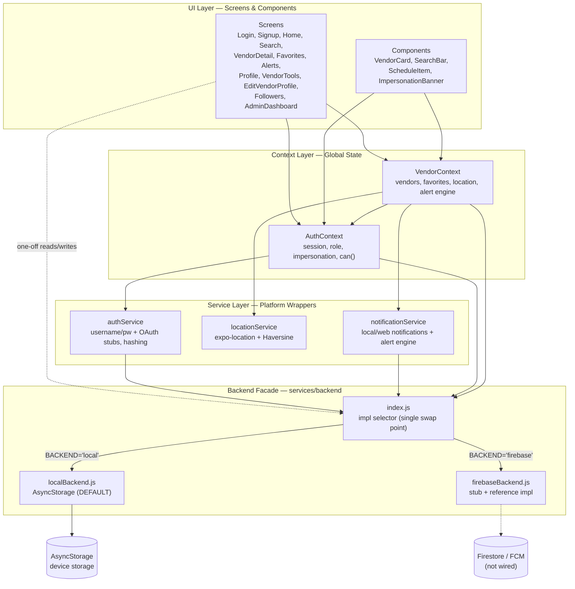
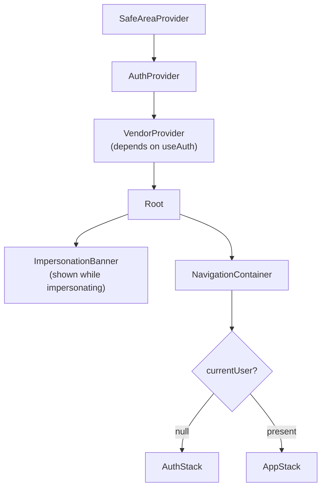
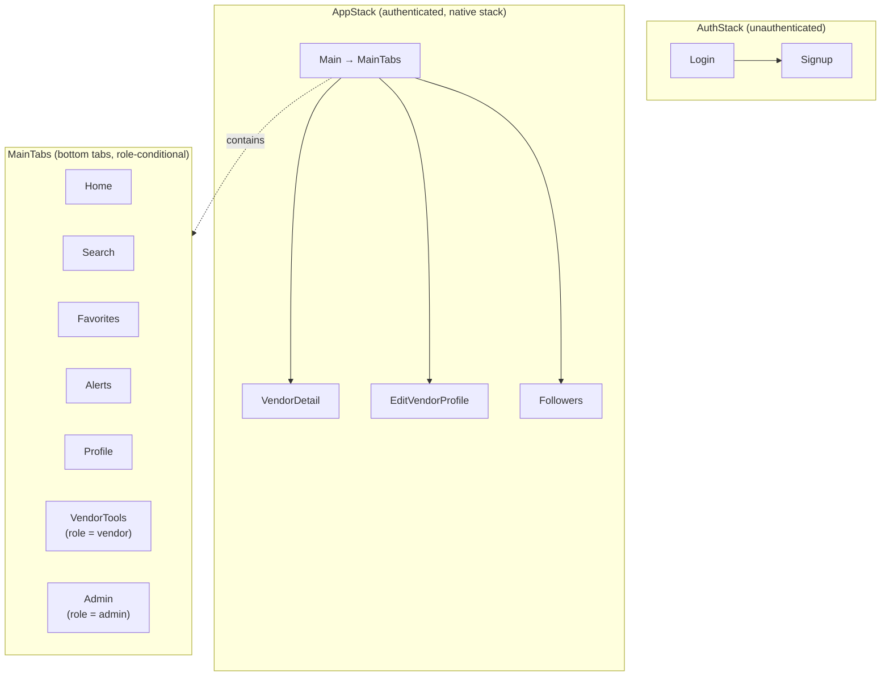
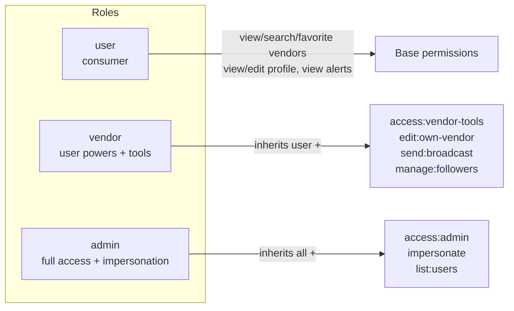
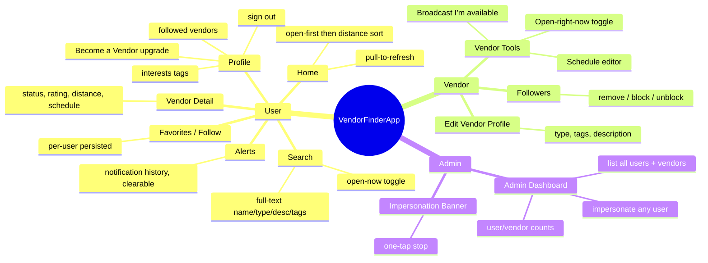
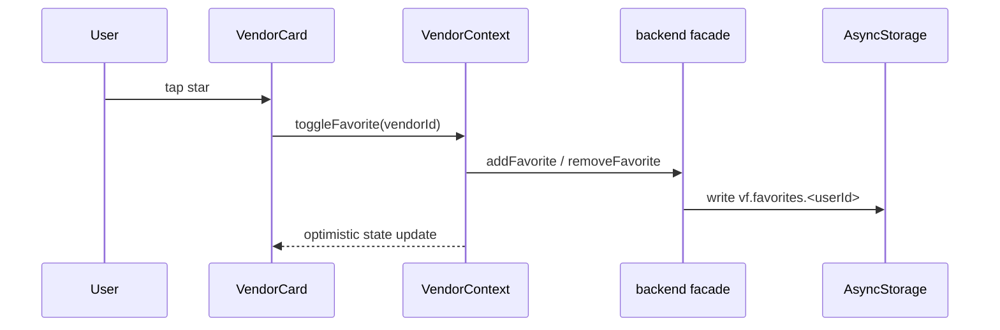
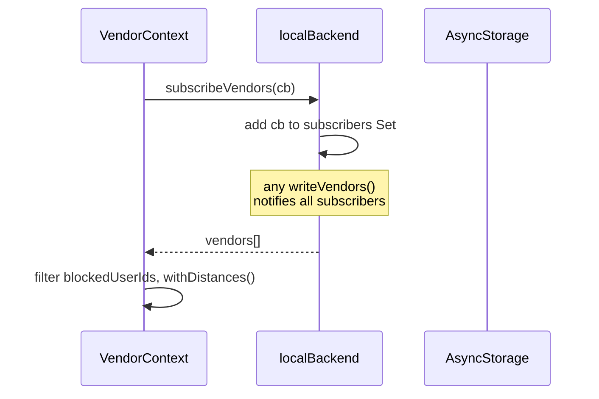
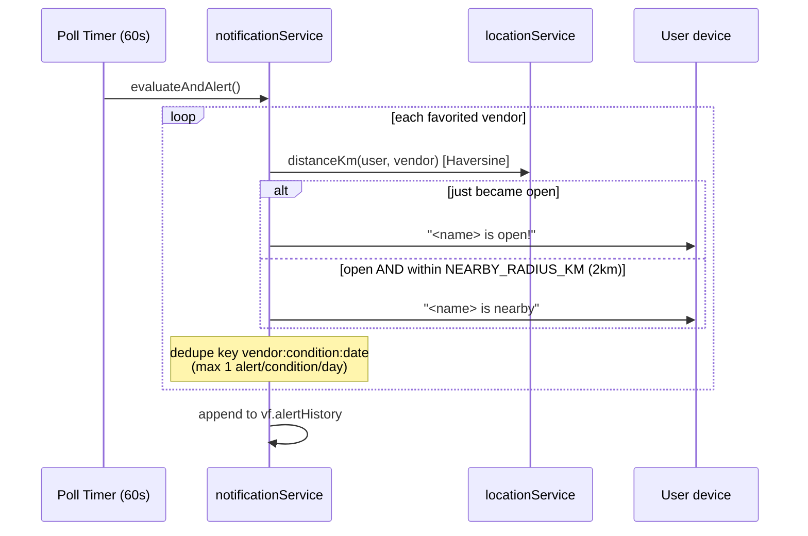
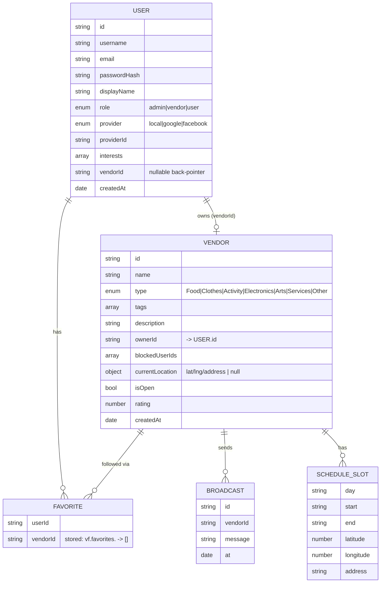
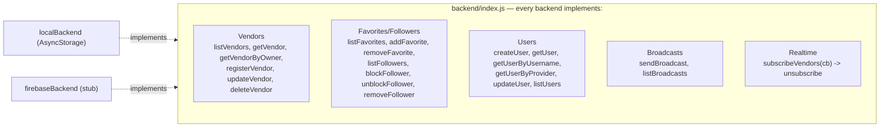

# VendorFinderApp — Features & Topology (Mermaid)

Cross-platform Expo / React Native app (iOS / Android / Web) connecting pop-up/mobile
vendors with customers who discover, follow, and get alerted about nearby open vendors.

---

## 1. Layered Architecture

---

## 2. Provider / Render Tree

---

## 3. Navigation Graph (role-gated)

---

## 4. Roles & RBAC

> Enforced in `AuthContext → checkPermission()` via `useAuth().can(action, resource?)`.
> `currentUser = actingAs ?? realUser` enables admin impersonation transparently.

---

## 5. Feature Map by Role

---

## 6. Key Data Flows

### 6a. Favorite toggle

### 6b. Realtime vendor list

### 6c. Location & alert engine

---

## 7. Data Model

---

## 8. Backend Abstraction Contract

> Swap backends by setting `BACKEND` in `src/config.js` (`'local'` | `'firebase'`).
> No screen, context, or component changes required.

---

## Tech Stack (reference)

- **Framework:** Expo SDK ~50, React Native 0.73, React 18 — JavaScript (ES modules)
- **Web:** react-native-web via Metro bundler
- **Navigation:** @react-navigation native-stack + bottom-tabs
- **Storage:** @react-native-async-storage/async-storage (the local "database")
- **Location:** expo-location (+ mock LA fallback) — Haversine distance
- **Notifications:** expo-notifications (native) / window.Notification (web)
- **Config:** `BACKEND='local'`, `NEARBY_RADIUS_KM=2.0`, `ALERT_POLL_INTERVAL_MS=60000`
- **Demo login:** `admin` / `admin123`
